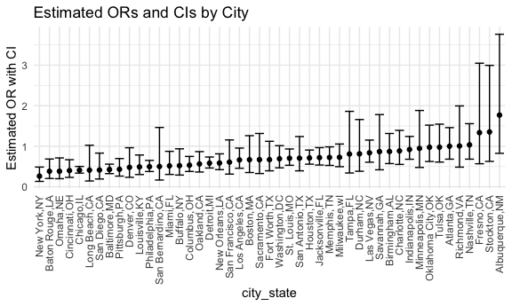

p8105_hw6_zg2486
================

# Problem 1

# Problem 2

#### Import and clean dataset.

``` r
homicide_df = 
  read_csv("./data/homicide-data.csv") %>% 
  filter(victim_age != "Unknown", victim_race != "Unknown", victim_sex != "Unknown" ) %>% 
  mutate(
    city_state = str_c(city, state, sep = ","),
    resolution = case_when(
      disposition == "Closed without arrest" ~ "unsolved",
      disposition == "Open/No arrest"        ~ "unsolved",
      disposition == "Closed by arrest"      ~ "solved"),
    victim_age = as.numeric(victim_age)
  ) %>%
  filter(!city_state %in% c("Dallas,TX", "Phoenix,AZ", "Kansas City,MO", "Tulsa,AL")) %>% 
  filter(victim_race %in% c("White", "Black")) 
```

    ## Rows: 52179 Columns: 12
    ## ── Column specification ────────────────────────────────────────────────────────
    ## Delimiter: ","
    ## chr (9): uid, victim_last, victim_first, victim_race, victim_age, victim_sex...
    ## dbl (3): reported_date, lat, lon
    ## 
    ## ℹ Use `spec()` to retrieve the full column specification for this data.
    ## ℹ Specify the column types or set `show_col_types = FALSE` to quiet this message.

#### GLM for Baltimore,MD.

``` r
baltimore_model = 
  homicide_df %>% 
  filter(city_state == "Baltimore,MD") %>% 
  mutate(resolved = as.numeric(resolution == "solved")) %>%
  nest(data = -city_state) %>% 
  mutate(
    model = map(data, \(x) glm(resolved ~ victim_age + victim_race + victim_sex, 
                data = x, family = binomial())),
    results = map(model, broom::tidy, conf.int = TRUE)
  ) %>% 
  unnest(results) %>% 
  filter(term == "victim_sexMale") %>% 
  mutate(
    OR = exp(estimate),
    lower_ci = exp(conf.low), 
    upper_ci = exp(conf.high)
  ) %>% 
  select(city_state, OR, lower_ci, upper_ci) 

baltimore_model %>% 
  knitr::kable(digits = 3)
```

| city_state   |    OR | lower_ci | upper_ci |
|:-------------|------:|---------:|---------:|
| Baltimore,MD | 0.426 |    0.324 |    0.558 |

The adjusted odds ratio and 95 CI for solving homicides comparing male
victims to female victims keeping all other variables fixed is 0.426
(95% CI: 0.324, 0.558).

#### Glm for each city.

``` r
each_city_model = 
  homicide_df %>% 
  mutate(resolved = as.numeric(resolution == "solved")) %>%
  nest(data = -city_state) %>% 
  mutate(
    model = map(data, \(x) glm(resolved ~ victim_age + victim_race + victim_sex, 
                data = x, family = binomial())),
    results = map(model, broom::tidy, conf.int = TRUE)
  ) %>% 
  unnest(results) %>% 
  filter(term == "victim_sexMale") %>% 
  mutate(
    OR = exp(estimate),
    lower_ci = exp(conf.low),
    upper_ci = exp(conf.high)
  ) %>% 
  select(city_state, OR, lower_ci, upper_ci) 

each_city_model %>% 
  knitr::kable(digits = 3)
```

| city_state        |    OR | lower_ci | upper_ci |
|:------------------|------:|---------:|---------:|
| Albuquerque,NM    | 1.767 |    0.825 |    3.762 |
| Atlanta,GA        | 1.000 |    0.680 |    1.458 |
| Baltimore,MD      | 0.426 |    0.324 |    0.558 |
| Baton Rouge,LA    | 0.381 |    0.204 |    0.684 |
| Birmingham,AL     | 0.870 |    0.571 |    1.314 |
| Boston,MA         | 0.667 |    0.351 |    1.260 |
| Buffalo,NY        | 0.521 |    0.288 |    0.936 |
| Charlotte,NC      | 0.884 |    0.551 |    1.391 |
| Chicago,IL        | 0.410 |    0.336 |    0.501 |
| Cincinnati,OH     | 0.400 |    0.231 |    0.667 |
| Columbus,OH       | 0.532 |    0.377 |    0.748 |
| Denver,CO         | 0.479 |    0.233 |    0.962 |
| Detroit,MI        | 0.582 |    0.462 |    0.734 |
| Durham,NC         | 0.812 |    0.382 |    1.658 |
| Fort Worth,TX     | 0.669 |    0.394 |    1.121 |
| Fresno,CA         | 1.335 |    0.567 |    3.048 |
| Houston,TX        | 0.711 |    0.557 |    0.906 |
| Indianapolis,IN   | 0.919 |    0.678 |    1.241 |
| Jacksonville,FL   | 0.720 |    0.536 |    0.965 |
| Las Vegas,NV      | 0.837 |    0.606 |    1.151 |
| Long Beach,CA     | 0.410 |    0.143 |    1.024 |
| Los Angeles,CA    | 0.662 |    0.457 |    0.954 |
| Louisville,KY     | 0.491 |    0.301 |    0.784 |
| Memphis,TN        | 0.723 |    0.526 |    0.984 |
| Miami,FL          | 0.515 |    0.304 |    0.873 |
| Milwaukee,wI      | 0.727 |    0.495 |    1.054 |
| Minneapolis,MN    | 0.947 |    0.476 |    1.881 |
| Nashville,TN      | 1.034 |    0.681 |    1.556 |
| New Orleans,LA    | 0.585 |    0.422 |    0.812 |
| New York,NY       | 0.262 |    0.133 |    0.485 |
| Oakland,CA        | 0.563 |    0.364 |    0.867 |
| Oklahoma City,OK  | 0.974 |    0.623 |    1.520 |
| Omaha,NE          | 0.382 |    0.199 |    0.711 |
| Philadelphia,PA   | 0.496 |    0.376 |    0.650 |
| Pittsburgh,PA     | 0.431 |    0.263 |    0.696 |
| Richmond,VA       | 1.006 |    0.483 |    1.994 |
| San Antonio,TX    | 0.705 |    0.393 |    1.238 |
| Sacramento,CA     | 0.669 |    0.326 |    1.314 |
| Savannah,GA       | 0.867 |    0.419 |    1.780 |
| San Bernardino,CA | 0.500 |    0.166 |    1.462 |
| San Diego,CA      | 0.413 |    0.191 |    0.830 |
| San Francisco,CA  | 0.608 |    0.312 |    1.155 |
| St. Louis,MO      | 0.703 |    0.530 |    0.932 |
| Stockton,CA       | 1.352 |    0.626 |    2.994 |
| Tampa,FL          | 0.808 |    0.340 |    1.860 |
| Tulsa,OK          | 0.976 |    0.609 |    1.544 |
| Washington,DC     | 0.691 |    0.466 |    1.014 |

#### Create a plot that shows the estimated ORs and CIs for each city.

``` r
each_city_plot =
  each_city_model %>% 
  arrange(OR) %>% 
  mutate(city_state = fct_reorder(city_state, OR)) %>% 
  ggplot(aes(x = city_state, y = OR)) +
  geom_point() +
  geom_errorbar(aes(ymin = lower_ci, ymax = upper_ci)) +
  theme(axis.text.x = element_text(angle = 90, vjust = 0.5, hjust = 1)) +
  labs(
    title = "Estimated ORs and CIs by City",
    x = "city_state",
    y = "Estimated OR with CI"
  )

each_city_plot 
```



# Problem 3

#### Import and clean data.

``` r
bwt_df = 
  read_csv("./data/birthweight.csv") %>% 
  janitor::clean_names() %>% 
  mutate(
    babysex = 
        case_match(babysex,
            1 ~ "male",
            2 ~ "female"
        ),
    babysex = fct_infreq(babysex),
    frace = 
        case_match(frace,
            1 ~ "white",
            2 ~ "black", 
            3 ~ "asian", 
            4 ~ "puerto rican", 
            8 ~ "other"),
    frace = fct_infreq(frace),
    mrace = 
        case_match(mrace,
            1 ~ "white",
            2 ~ "black", 
            3 ~ "asian", 
            4 ~ "puerto rican",
            8 ~ "other"),
    mrace = fct_infreq(mrace),
    malform = as.logical(malform)) %>% 
  drop_na()
```

    ## Rows: 4342 Columns: 20
    ## ── Column specification ────────────────────────────────────────────────────────
    ## Delimiter: ","
    ## dbl (20): babysex, bhead, blength, bwt, delwt, fincome, frace, gaweeks, malf...
    ## 
    ## ℹ Use `spec()` to retrieve the full column specification for this data.
    ## ℹ Specify the column types or set `show_col_types = FALSE` to quiet this message.
